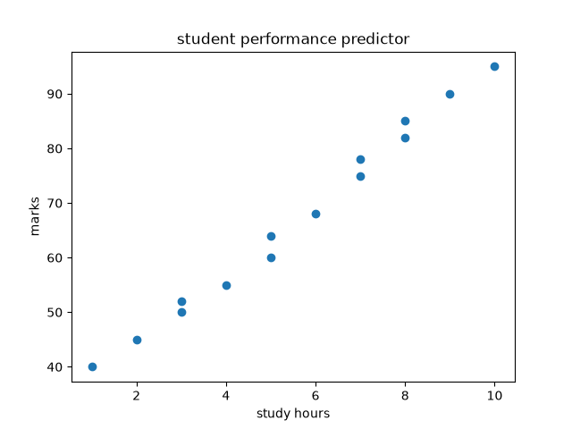

# Student Performance Predictor

## Overview
This machine learning project predicts student performance based on study hours.

## Features
- Predicts student marks
- Uses Linear Regression
- Displays performance graph
- User-friendly interface

## Technologies Used
- Python
- Pandas
- NumPy
- Matplotlib
- Scikit-Learn
- Streamlit

## Dataset
The dataset contains:
- Study Hours
- Marks
## project output
the model predicts the student marks based on student study hours

## sample graph

## WARNING
 this is made for just practise and this does not contain any commercial or professional use  and now this would be concluuded as the project for my college ..

## How to Run

Install dependencies:

bash
pip install -r requirements.txt

Run:

bash
streamlit run app.py

## Author
Yashik
## It`s made with guidance in AI..